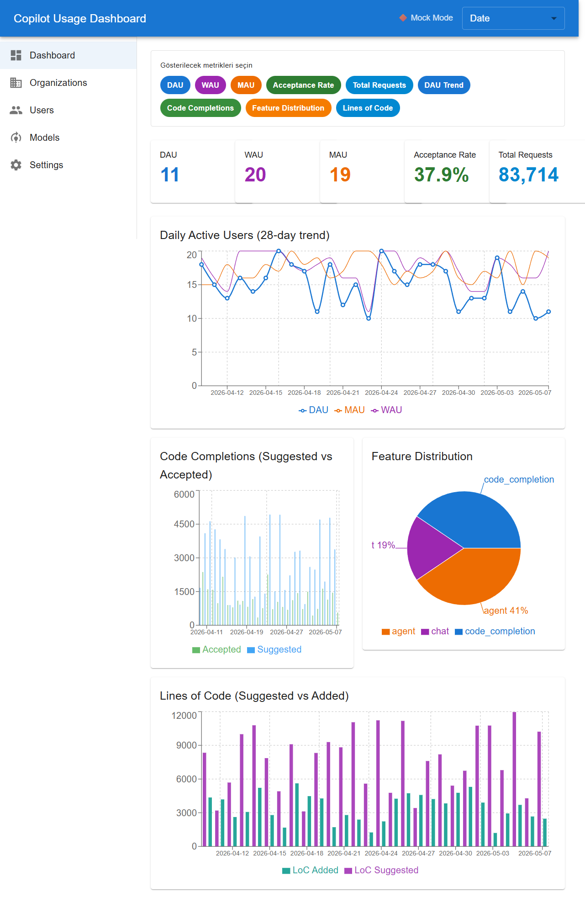
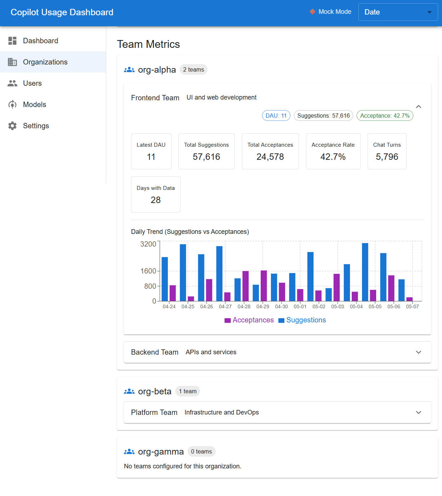
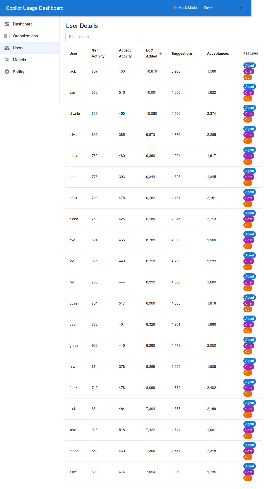
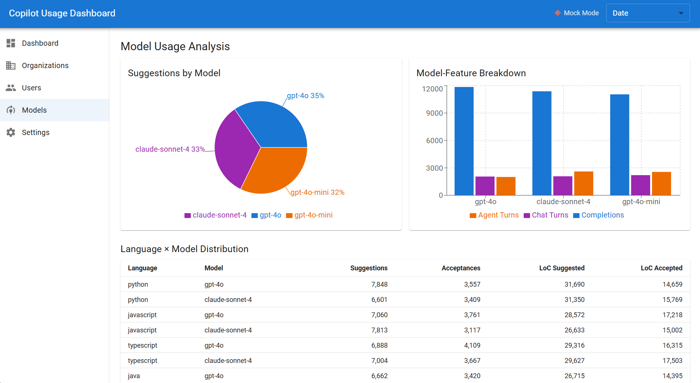
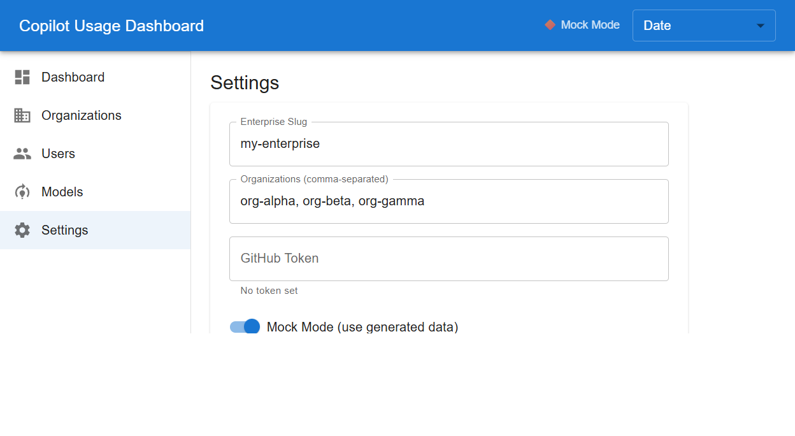

# GitHub Copilot Usage Metrics Dashboard

A full-stack dashboard for visualizing GitHub Copilot usage metrics across your enterprise and organizations.

**Backend:** Python FastAPI · **Frontend:** React + Vite + Material UI + Recharts

## Features

- **Enterprise dashboard (28-day trend + single-day filter)** — DAU/WAU/MAU, suggestions, acceptances, acceptance rate, and LoC metrics
- **Configurable metric widgets** — toggle cards/charts on/off (DAU, WAU, MAU, acceptance rate, requests, trends, feature distribution, LoC)
- **Organization comparison view** — side-by-side org table and chart for DAU, suggestions, acceptances, and acceptance %
- **Team-level metrics under each organization** — team list + per-team metrics, summary chips, KPI cards, and 14-day suggestions/acceptances trend
- **User-level drill-down** — sortable/filterable user table with feature flags (Agent/Chat/CLI) and per-user detail dialog
- **Model usage analysis** — model pie chart, model-feature bar chart, and language x model distribution table
- **Runtime settings management UI** — update enterprise/org list/mock mode/token and test live GitHub API connection
- **Mock mode with realistic nested data** — development-ready data for enterprise, org, team, user, feature, IDE, model, language, CLI, and PR metrics
- **Live GitHub API mode** — NDJSON download link parsing for enterprise/org/team usage endpoints

## Detailed Feature Breakdown

## Screenshots

> Screenshots below are captured from the running app in mock mode.

### Dashboard



### Organizations + Team Metrics



### Users



### Models



### Settings



### Dashboard Page (`/`)

- Date selector supports **Last 28 days** aggregate or a **specific day** filter.
- Summary cards: DAU, WAU, MAU, Acceptance Rate, Total Requests.
- Charts:
	- DAU trend (DAU/WAU/MAU line chart)
	- Code completions (suggested vs accepted)
	- Feature distribution (pie)
	- Lines of code (suggested vs accepted)
- Metric chip toggles let users customize what is visible.

### Organizations Page (`/organization`)

- Compares configured organizations in a table and bar chart.
- **Team Metrics section** for every organization:
	- Fetches org teams list
	- Lazy-loads team metrics when accordion is expanded
	- Shows per-team DAU, suggestions, acceptances, acceptance %, chat turns, and available days
	- Renders per-team daily trend chart (last 14 days)

### Users Page (`/users`)

- Enterprise user metrics table with:
	- Text filtering by username
	- Column sorting (activity, LoC, suggestions, acceptances)
	- Feature badges (`Agent`, `Chat`, `CLI`)
- User detail dialog includes:
	- Feature breakdown
	- IDE breakdown
	- Language/model breakdown
	- CLI token usage (input/output)
- When no day is selected, user metrics are aggregated across the returned period.

### Models Page (`/models`)

- Aggregates model-feature usage across returned days.
- Visuals and tables:
	- Suggestions by model (pie)
	- Model-feature usage bars
	- Language x model distribution with suggestions/acceptances/LoC

### Settings Page (`/settings`)

- Reads and updates runtime backend settings.
- Supports changing:
	- Enterprise slug
	- Organization list
	- Mock mode
	- GitHub token (masked when present)
- Includes connection test endpoint integration.

### Backend Capabilities

- FastAPI service with CORS enabled for local Vite frontend.
- Unified response models for metrics, users, teams, and settings.
- Supports both:
	- Mock data generation mode
	- Live GitHub API mode (with API version header and bearer token)
- GitHub client handles `download_links` responses and parses NDJSON payloads.

### Data Dimensions Covered

- Activity: DAU, WAU, MAU, engaged/active users
- Suggestions/acceptances and acceptance rates
- LoC suggested/accepted
- Feature-level totals (`code_completion`, `chat`, `agent`, etc.)
- IDE-level totals
- Model-feature totals
- Language-model totals
- CLI token usage
- Pull request metrics

## Quick Start

### Prerequisites

- Python 3.10+
- Node.js 18+

> **Important:** Two separate terminals are needed — one for the backend, one for the frontend.

---

### 1. Backend (Terminal 1)

#### macOS / Linux

```bash
cd backend
python3 -m venv .venv
source .venv/bin/activate
pip install -r requirements.txt
uvicorn app.main:app --reload
```

#### Windows (PowerShell)

Run each line one by one:

```powershell
cd backend
python -m venv .venv --without-pip
Set-ExecutionPolicy -Scope Process -ExecutionPolicy RemoteSigned
.\.venv\Scripts\Activate.ps1
python -m ensurepip --upgrade
pip install -r requirements.txt
python -m uvicorn app.main:app
```

> **Why `--without-pip`?** On Windows, especially when the project is inside a OneDrive-synced folder or a path with spaces, `python -m venv .venv` can hang during the `ensurepip` subprocess. Creating the venv without pip and installing it separately avoids this.
>
> **Why no `--reload`?** The `--reload` flag uses a file watcher that can conflict with OneDrive file sync on Windows. If you need auto-reload and don't have OneDrive issues, add `--reload`.

Backend runs at **http://localhost:8000** · Swagger UI: **http://localhost:8000/docs**

---

### 2. Frontend (Terminal 2)

```bash
cd frontend
npm install
npm run dev
```

Frontend runs at **http://localhost:5173** with API proxy to the backend.

---

### 3. Open the dashboard

Navigate to **http://localhost:5173** in your browser. Mock mode is enabled by default.

## Configuration

Copy `backend/.env.example` to `backend/.env` and edit:

| Variable | Default | Description |
|---|---|---|
| `GITHUB_TOKEN` | *(empty)* | GitHub PAT with `manage_billing:copilot` scope |
| `GITHUB_API_URL` | `https://api.github.com` | GitHub API base URL |
| `GITHUB_API_VERSION` | `2026-03-10` | API version header |
| `MOCK_MODE` | `true` | Use mock data (`true`) or live API (`false`) |
| `ENTERPRISE_SLUG` | `my-enterprise` | Your GitHub enterprise slug |
| `ORGANIZATIONS` | `org-alpha,org-beta,org-gamma` | Comma-separated org names |

Settings can also be changed at runtime via the Settings page in the dashboard.

## API Endpoints

| Method | Path | Description |
|---|---|---|
| GET | `/api/enterprise/{slug}/metrics?day=` | Enterprise metrics (28-day or single day) |
| GET | `/api/enterprise/{slug}/users?day=` | Enterprise user metrics |
| GET | `/api/org/{org}/metrics?day=` | Organization metrics |
| GET | `/api/org/{org}/users?day=` | Organization user metrics |
| GET | `/api/org/{org}/teams` | Organization team list |
| GET | `/api/org/{org}/team/{team_slug}/metrics?day=` | Team metrics under organization |
| GET | `/api/settings` | Current settings (token masked) |
| POST | `/api/settings` | Update settings |
| POST | `/api/settings/test-connection` | Test GitHub API connection |
| GET | `/api/health` | Health check |

## Project Structure

```
├── backend/
│   ├── app/
│   │   ├── main.py              # FastAPI application
│   │   ├── config.py            # Settings (env vars)
│   │   ├── models.py            # Pydantic models
│   │   ├── mock_data.py         # Mock data generator
│   │   ├── github_client.py     # Async GitHub API client
│   │   └── routers/
│   │       ├── enterprise.py    # Enterprise endpoints
│   │       ├── organization.py  # Organization endpoints
│   │       └── settings.py      # Settings endpoints
│   ├── requirements.txt
│   └── .env.example
├── frontend/
│   ├── src/
│   │   ├── App.jsx              # Router setup
│   │   ├── api.js               # API client (axios)
│   │   ├── components/
│   │   │   ├── Layout.jsx       # App shell (AppBar + Sidebar)
│   │   │   ├── Sidebar.jsx      # Navigation
│   │   │   ├── DateRangePicker.jsx
│   │   │   └── charts/          # Recharts components
│   │   └── pages/
│   │       ├── Dashboard.jsx
│   │       ├── OrganizationView.jsx
│   │       ├── UserView.jsx
│   │       ├── ModelUsage.jsx
│   │       └── Settings.jsx
│   └── vite.config.js
└── README.md
```
